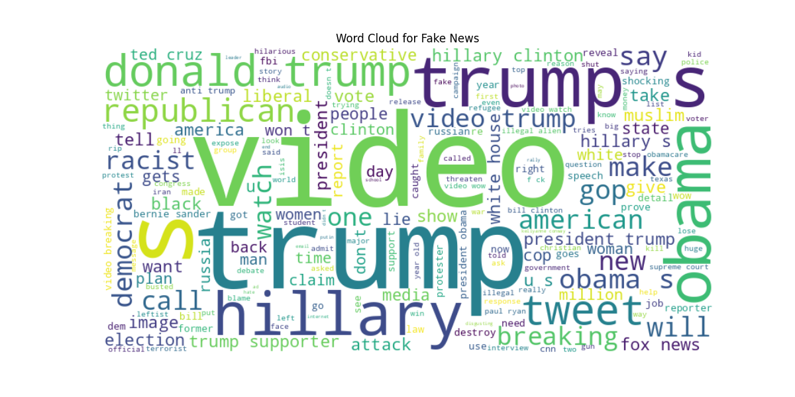
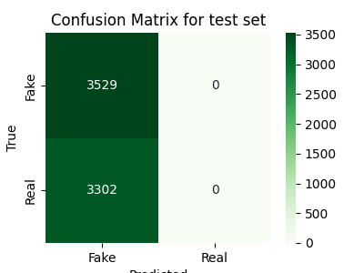
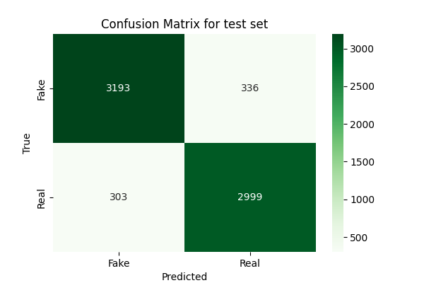

---
output:
  beamer_presentation:
    pdf-engine: xelatex
    listings: true
title: NLP - Fake news detection
author: [Simbiat Musa, Georg F.K. Höhn]
short-author: [Musa, Höhn]
institute: Ironhack
date: 19 June 2025
section-titles: true
tables: true
indent: true
theme: default
colortheme: greenmeadow
bibliography: /home/georg/academia/BibTeXreferences/literature.bib
babel-lang: english
lang: en-GB
language: english
mainfont: Linux Biolinum
monofont: DejaVu Sans Mono
fontsize: 13pt
papersize: a4paper
numbersections: true
csquotes: true
---

## Project overview

### Given

- dataset of headlines annotated as `fake` (0) or `real` (1) 

### Aim

- classify news headlines in unseen data (using machine learning)

### Deliverables
  
- Python pipeline (+ csv with model training results)
- csv with predictions for test set

## 

\tableofcontents

# Data overview

##

- 34152 rows of annotated data
  - fake news: 17572
  - real news: 16580
- relatively balanced

## Word cloud for data annotated as real

## Word cloud for data annotated as fake

# Methodology

## Structure

- one main `.py` file for data exploration, model experimentation and output generation
- `helper.py` with functions for
  - cleaning strings
  - generate, print and save model evaluations (to csv)
  - removing stop words (not needed with TF-IDF vectoriser)
  - lemmatizer (currently not used)
  - huggingface pipeline for transformer models

## General pipeline

- EDA
- clean data (generate new columns)
- train-test split (20% test size)
- vectorise train and test sets
- train (and tune?) models
- compare based on test accuracy
- run best model(s) on target data and save
- (run best models of different types on target data and calculate inter-annotator agreement)

##

### Vectorisation

- TF-IDF 
- GloVE (`glove-wiki-gigaword-100`)

### ML-algorithms

- Logistic Regression (`sklearn.linear_model.LinearRegression`)
- Random Forest (`sklearn.ensemble.RandomForestClassifier`)
- KNN (`sklearn.neighbors.KNeighborsClassifier`)
- XGBoost (`xgboost.XGBClassifier`)

## Regarding transformer models

- tried pipelines with 
  1) `jy46604790/Fake-News-Bert-Detect`
  2) `omykhailiv/bert-fake-news-recognition`
- both performed abysmally: everything is fake, see result for 1
- over-sensitive? issue with our data pre-processing?

{ height="50%" }

# Training results

## 

\dummy{
  \small
  \begin{tabular}{llrr}
\toprule
model-id & params & acc-train & accuracy \\
\midrule
logreg-final & miter=500 & 0.917 & 0.908 \\
logreg-1000 & miter=1000 & 0.917 & 0.908 \\
xgb-final & est=500,mdepth=100,lr=0.3,α=0.1 & 0.990 & 0.906 \\
xgb & est=500,mdepth=100,lr=0.3 & 0.990 & 0.905 \\
xgb & est=400,mdepth=100,lr=0.5 & 0.990 & 0.905 \\
rndforest-final & est=300,min\_samp\_leaf=2 & 0.938 & 0.895 \\
xgb & est=100,mdepth=50,lr=0.04 & 0.915 & 0.882 \\
rndforest & est=100 & 1.000 & 0.878 \\
logreg-glove & miter=1000 & 0.869 & 0.870 \\
xgb & est=200,mdepth=50,lr=0.005 & 0.877 & 0.850 \\
rndforest & est=300,mdepth=30 & 0.868 & 0.842 \\
xgb & est=10,mdepth=50,lr=0.04 & 0.861 & 0.837 \\
knn & k=3 & 0.915 & 0.817 \\
knn & k=5 & 0.883 & 0.804 \\
knn & k=10 & 0.816 & 0.780 \\
omykhailiv & defaults & 0.514 & 0.517 \\
jy46604790 & defaults & 0.514 & 0.517 \\
\bottomrule
\end{tabular}
}

## 

- best performing: logistic regression model
  - max-iterations did not seem to make a difference
- xgb and RandomForest very close by
  - but: high risk of overfitting
  - longer training times/higher complexity

##

:::: {.columns}
::: {.column width="49%"}

:::
::: {.column width="49%"}

:::
::::

# Conclusion

##

- logistic regression model offers best performance here
- some confusion in our raw performance results.csv
  - some RandomForest models seemed to perform better than final model, but probably due to earlier mistakes in preprocessing?
  - lesson: also note changes to preprocessing or cleanly reset logging files

### Collaboration

- used py files to avoid notebook consistency issues with git
- VS Code offers the possibility of generating jupyter-like cells with `# %%` 

## 

\centering\LARGE Thanks for your attention!

