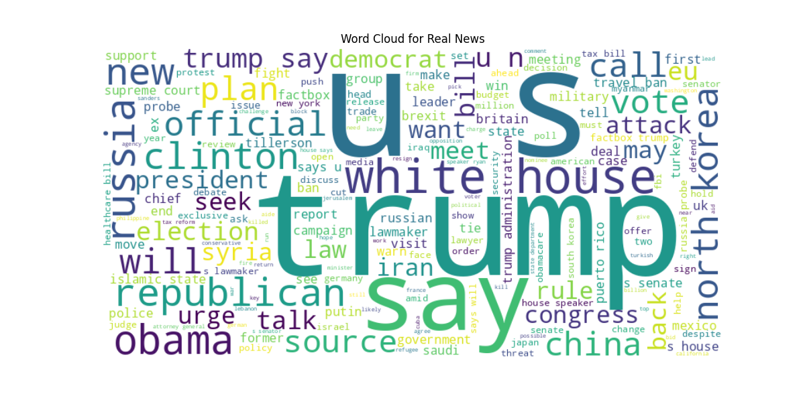
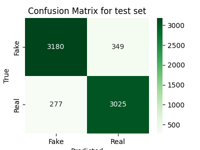

---
output:
  beamer_presentation:
    pdf-engine: xelatex
    listings: true
title: NLP - Fake news detection
author: [Simbiat Musa, Georg F.K. Höhn]
short-author: [Musa, Höhn]
institute: Ironhack
date: 19 June 2025
section-titles: true
tables: true
indent: true
theme: default
colortheme: greenmeadow
bibliography: /home/georg/academia/BibTeXreferences/literature.bib
babel-lang: english
lang: en-GB
language: english
mainfont: Linux Biolinum
monofont: DejaVu Sans Mono
fontsize: 13pt
papersize: a4paper
numbersections: true
csquotes: true
---

## Project overview

### Given

- dataset of headlines annotated as `fake` (0) or `real` (1) 

### Aim

- classify news headlines in unseen data (using machine learning)

### Deliverables
  
- Python pipeline (+ csv with model training results)
- csv with predictions for test set

## 

\tableofcontents

# Data overview

##

- 34152 rows of annotated data
  - fake news: 17572
  - real news: 16580
- relatively balanced

## Word cloud for data annotated as real

## Word cloud for data annotated as fake

# Methodology

## Structure

- one main `.py` file for data exploration, model experimentation and output generation
- `helper.py` with functions for
  - cleaning strings
  - generate, print and save model evaluations (to csv)
  - removing stop words (not needed with TF-IDF vectoriser)
  - lemmatizer (currently not used)
  - huggingface pipeline for transformer models

## General pipeline

- EDA
- clean data (generate new columns)
- train-test split (20% test size)
- vectorise train and test sets
- train (and tune?) models
- compare based on test accuracy
- run best model(s) on target data and save
- (run best models of different types on target data and calculate inter-annotator agreement)

##

### Vectorisation

- TF-IDF 
- GloVE (`glove-wiki-gigaword-100`)

### ML-algorithms

- Logistic Regression (`sklearn.linear_model.LinearRegression`)
- Random Forest (`sklearn.ensemble.RandomForestClassifier`)
- KNN (`sklearn.neighbors.KNeighborsClassifier`)
- XGBoost (`xgboost.XGBClassifier`)

## Regarding transformer models

- tried pipelines with 
  1) `jy46604790/Fake-News-Bert-Detect`
  2) `omykhailiv/bert-fake-news-recognition`
- both performed abysmally: everything is fake, see result for 1
- over-sensitive? issue with our data pre-processing?

{ height="50%" }

# Training results

## 

\dummy{
  \small
\begin{tabular}{llrr}
\toprule
model\_id & params & acc\_train & accuracy \\
\midrule
logreg\_lemma & miter=500 & 0.9209 & 0.9133 \\
xgb\_lemma\ & est=500,depth=100,lr=0.3,α=0.1 & 0.9963 & 0.9130 \\
logreg\_final & miter=500 & 0.9172 & 0.9084 \\
logreg\_1000 & miter=1000 & 0.9172 & 0.9084 \\
xgb\_final & est=500,depth=100,lr=0.3,α=0.1 & 0.9899 & 0.9065 \\
xgb & est=500,depth=200,lr=0.07,α=0.1 & 0.9896 & 0.9037 \\
xgb\_2 & est=200,depth=0,lr=0.1 & 0.9896 & 0.9026 \\
rndforest\_lemma & est=300,minsleaf=2 & 0.9409 & 0.9002 \\
xgb\_2 & est=200,depth=50,lr=0.04 & 0.9407 & 0.8971 \\
rndforest\_final & est=300,minsleaf=2 & 0.9382 & 0.8949 \\
xgb\_1 & defaults & 0.9002 & 0.8807 \\
logreg\_glove & miter=500 & 0.8689 & 0.8703 \\
rndforest\_2 & est=300,depth=30 & 0.8677 & 0.8418 \\
xgb\_2 & est=10,depth=50,lr=0.04 & 0.8611 & 0.8371 \\
knn\_3 & k=3 & 0.9154 & 0.8172 \\
knn\_5 & k=5 & 0.8829 & 0.8037 \\
knn\_3\_lemma & k=3 & 0.8901 & 0.7993 \\
knn\_10 & k=10 & 0.8158 & 0.7804 \\
omykhailiv & defaults & 0.5140 & 0.5166 \\
jy46604790 & defaults & 0.5140 & 0.5166 \\
\bottomrule
\end{tabular}
}

## 

- best performing: logistic regression model with lemmatized dataset
  - max-iterations did not seem to make a difference
- xgb and RandomForest very close by
  - but: high risk of overfitting
  - longer training times/higher complexity
- knn not performing very well
  - using lemmatized dataset actually leads to drop in accuracy

## Confusion matrices LogReg

:::: {.columns}
::: {.column width="49%"}

:::
::: {.column width="49%"}

:::
::::

## Confusion matrices XGBoost

:::: {.columns}
::: {.column width="49%"}

:::
::: {.column width="49%"}

:::
::::

## Confusion matrices RandomForest

:::: {.columns}
::: {.column width="49%"}

:::
::: {.column width="49%"}

:::
::::

## Confusion matrices KNN

:::: {.columns}
::: {.column width="49%"}

:::
::: {.column width="49%"}

:::
::::

# Conclusion

##

- logistic regression model offers best performance

### Collaboration

- using py files to avoid notebook consistency issues with git
- `# %%`: useful VS Code option for generating jupyter-like cells 

### Outlook/reflection

  - further experimentation with vectoriser settings
  - actually implement lemmatisation (oops)
- some confusion in our raw performance results.csv
  - some RandomForest models seemed to perform better than final model, but probably due to earlier mistakes in preprocessing?
  - lesson: also note changes to preprocessing or cleanly reset logging files

## 

\centering\LARGE Thanks for your attention!

